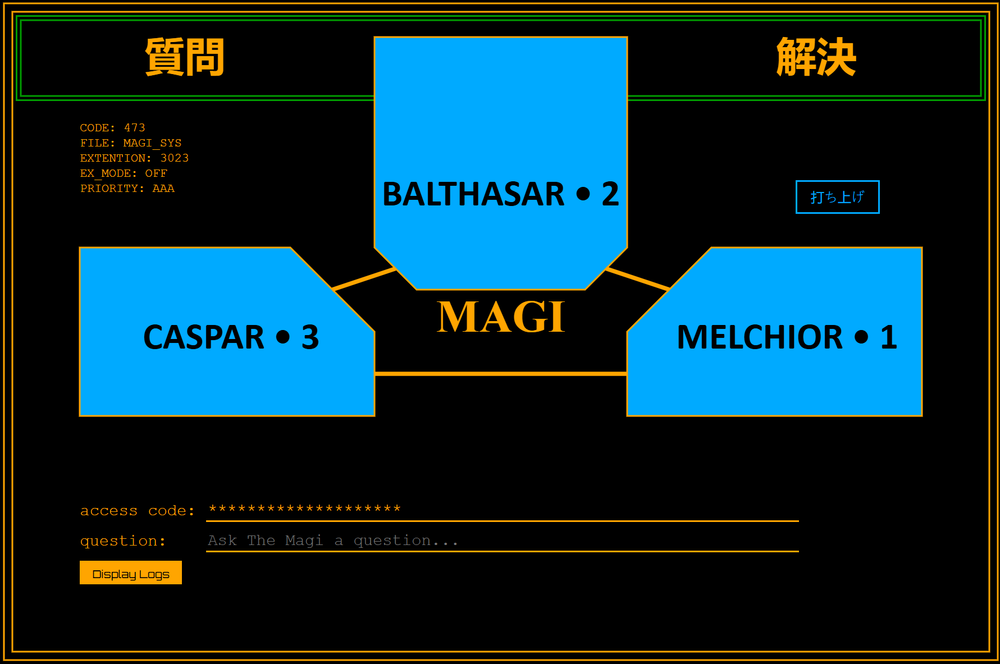

**The Magi**

A personal, omnipresent Artificial Intelligence system, built to serve a human as an omniscient board of directors. Built on windows using WSL

* Caspar - Mistral
* Melchior - Gemma
* Balthazar - Llama2

To run, clone the repo, launch a terminal and run:

```
install-magi.bat
```

and then

```
start-magi.bat
```

## Development

To run the web application in development mode with hot-reload:

```bash
cd ui
npm run start -- --poll=2000
```

This will start the development server at `http://localhost:4200`. The app will automatically reload if you change any of the source files. The `--poll` option is added to ensure file changes are detected, especially when working with WSL or network drives.

Copyright 2025 David Baldie (c)